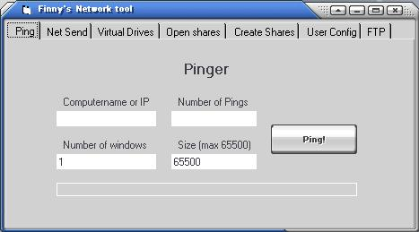



## Finny's Network Tool

### Description

This is a simple lan tool basicly to be used on a network. It can ping, netsend, create virtual drives, open normal and hidden shares, open FTPs, delete users, create users and change the password of users.
 
### More Info
 

             |
---                |---
**Submitted On**   |2004-01-18 01:32:00
**By**             |[Bradley Finn](https://github.com/Planet-Source-Code/PSCIndex/blob/master/ByAuthor/bradley-finn.md)
**Level**          |Intermediate
**User Rating**    |4.3 (17 globes from 4 users)
**Compatibility**  |VB 6\.0
**Category**       |[Internet/ HTML](https://github.com/Planet-Source-Code/PSCIndex/blob/master/ByCategory/internet-html__1-34.md)
**World**          |[Visual Basic](https://github.com/Planet-Source-Code/PSCIndex/blob/master/ByWorld/visual-basic.md)
**Archive File**   |[Finny's\_Ne1697501212004\.zip](https://github.com/Planet-Source-Code/bradley-finn-finny-s-network-tool__1-51148/archive/master.zip)

